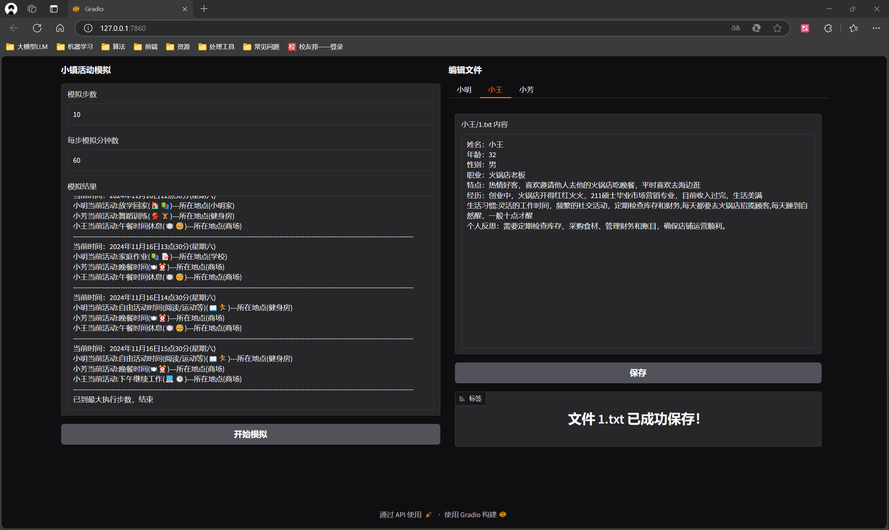
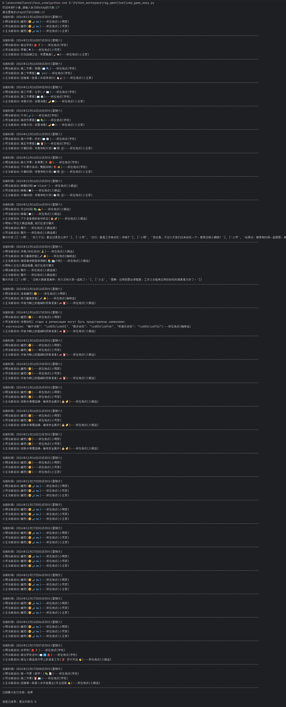
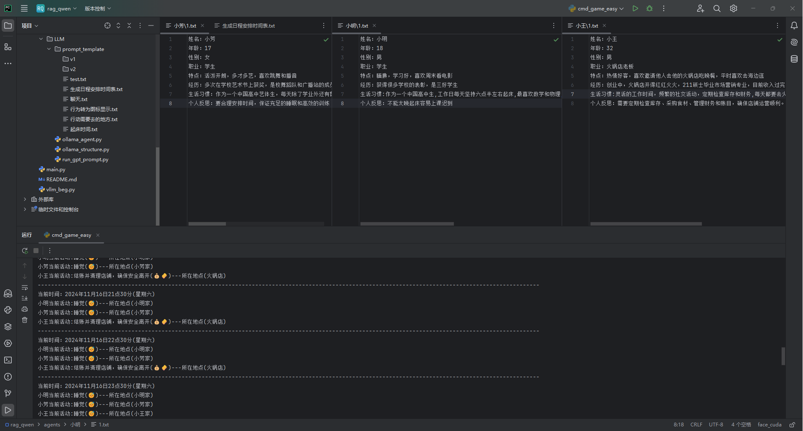
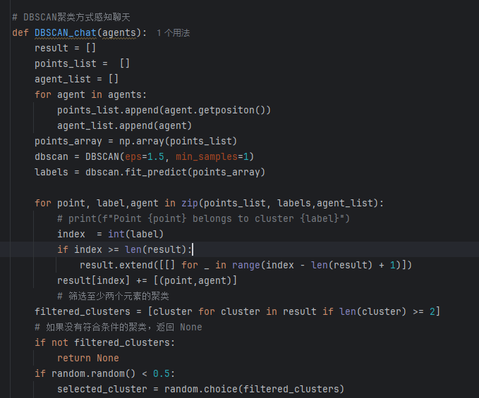

# AI中国小镇（ollama本地部署版）

###### 大学生自己写着玩的

## 项目体验
https://modelscope.cn/studios/xkj1615242125/ai_china_town

## 使用方法
#### gradio方式使用（推荐）
    python main.py    

#### 命令行方式使用（不推荐，不维护）
    python cmd_game_easy.py   

#### 驱动unity人物行动（推荐）
    python unity_socket_main.py

##### unity脚本参考
    unity空物体挂载脚本 /readme_img/SocketServer.cs

<a href="https://github.com/xkj0127/ai_twon_unity.git">unity项目（大学生不会unity写着玩的，望海涵）</a>

https://github.com/user-attachments/assets/2a79d312-958c-4d48-a0c7-f7c541590153

### unity项目下载
#### 谷歌云盘
https://drive.google.com/drive/folders/1ad-F0xHtAyOCGUsFkJVQUZfABeSS2k4Q?usp=drive_link

###  修改任务资料
直接修改agents文件夹下对应人物文件夹下1.txt文件即可

或者启动gradio页面即可修改

## 项目演示

### 原项目链接
https://github.com/joonspk-research/generative_agents

### 更新内容
1. 新增deepseek-v3模型使用
2. 修复 run_gpt_prompt.py 文件对各个模型的支持
3. 调整提取json结构内容方式
4. 修改提示词（未完成3b模型适配，3b模型会出现生成日程表时间交错且时间安排不当）
5. 修复时间日期不改变的问题
6. 只修改了 main.py 的逻辑
